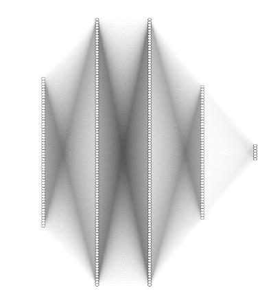
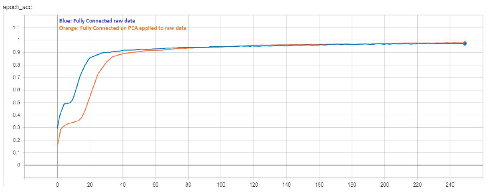
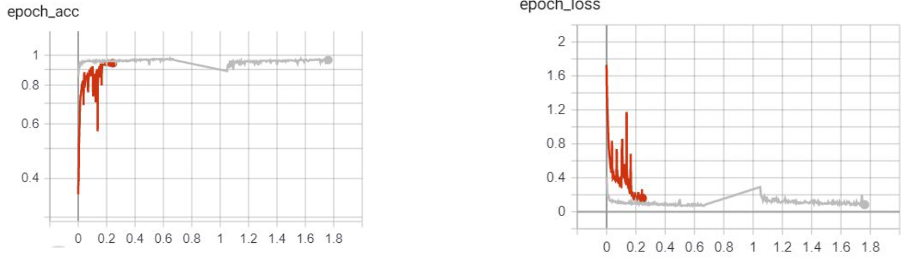
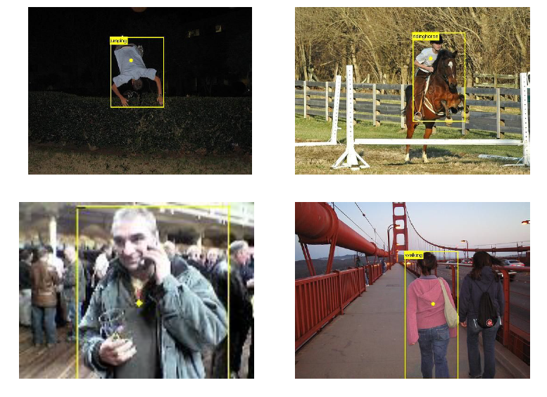
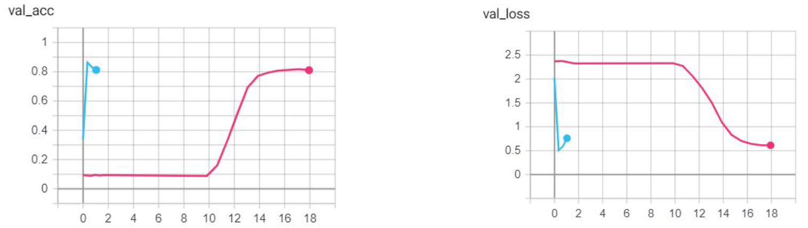

# Human activity recoginition with Deep learning
Final project for Nile university CIT-651 Machine learning class - Fall 19
Experiments are performed on Pascal VOC 2012, Kaggle statefarm distracted driver and UCI Har dataset.

### UCI HAR Dataset
##### Fully Connected network
Trained on Raw data features 561x1.

##### 1D CNN
Trained with time stamp readings 9x128.

### VOC 2012 Dataset (Indoor, Outdoor, ... )
Trained with 512x512 images with/without bounding box cropping with random augmentation.

### Statefarm dataset (Inside vehicle)
Trained with 480x640 images with random augmentation.

# References:
Template structure and config scripts from [Template link](https://github.com/moemen95/Pytorch-Project-Template)
